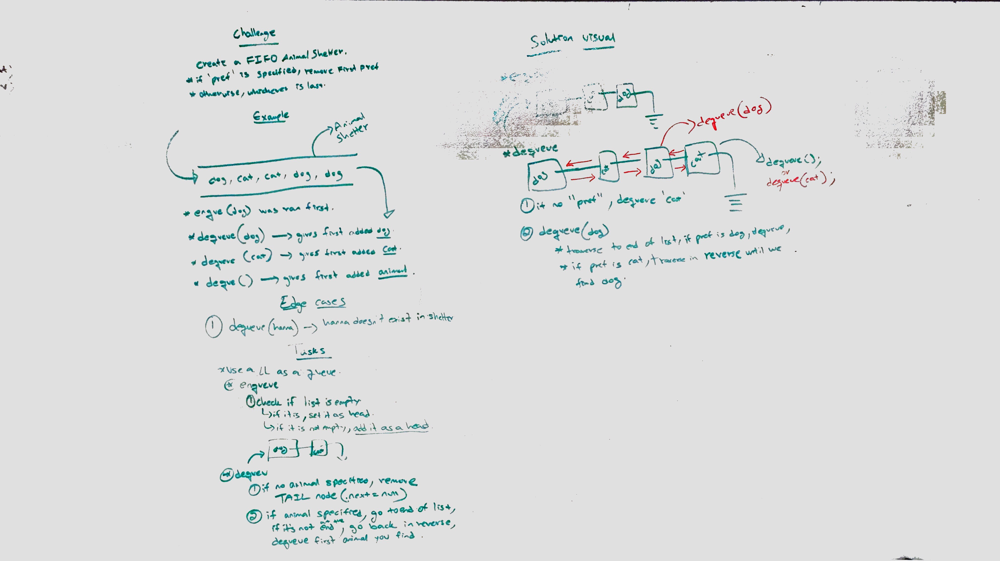
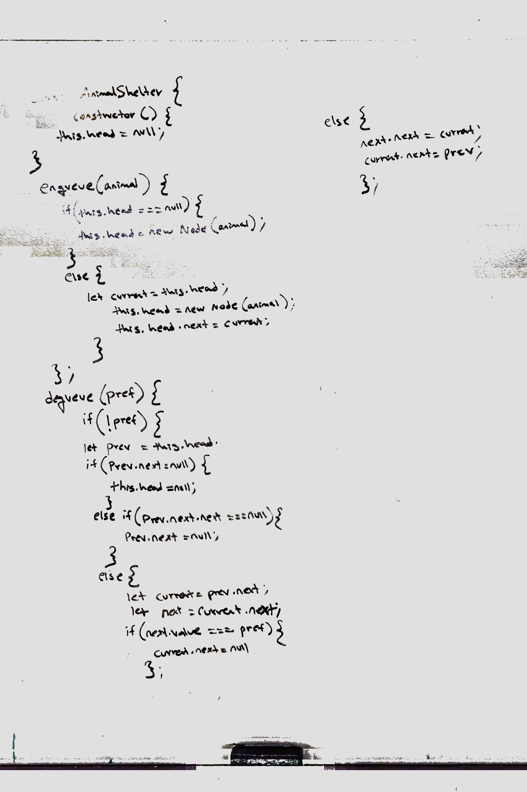
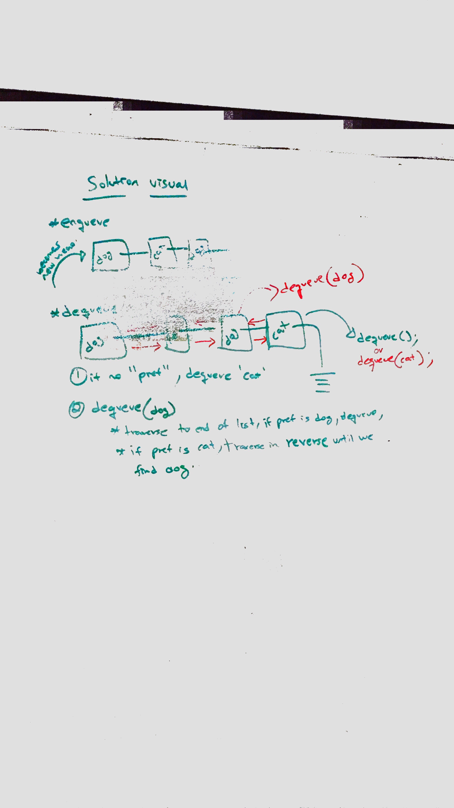

# Code challenge - 32

## First-in, First out Animal Shelter.

## Author: Hanna ALemu

## Intro
A queue implements FIFO, so the shelter will reflect that

# Challenge Summary
Create a class called AnimalShelter which holds only dogs and cats. The shelter operates using a first-in, first-out approach.

## Approach & Efficiency
At first I attempted using a doubly linked list as a queue because I didn't realize we could use the built in queue. Now, I have a queue class and the enqueue and dequeue methods. It's also using ID to know which animal comes first.

## Solution
## White board example

