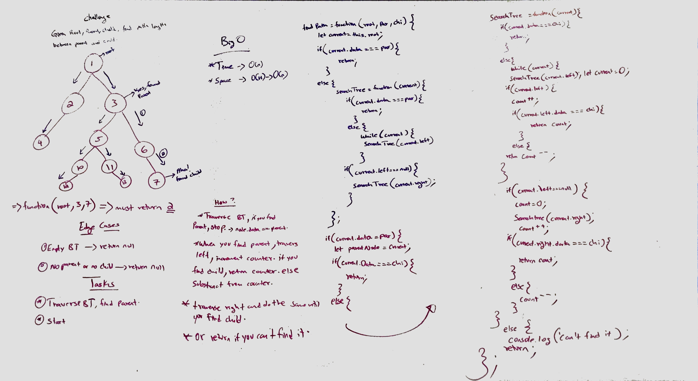

# Code challenge - 18

## Binary trees - Find path between a parent and child node.

## Author: Hanna ALemu

## Intro
A tree whose elements have at most 2 children is called a binary tree. Since each element in a binary tree can have only 2 children, we typically name them the left and right child.A Binary Tree node contains following parts.

* Data
* Pointer to left child
* Pointer to right child

# Challenge Summary

Write a function, that takes a root node, a parent node and a child node, returns the path length between the parent node and the child node.

## Approach & Efficiency

I aproached this challenge by simplifying the tasks and using a helper function. I used recursion that starts counting the path when it finds the parent node. It then keeps recursing until it finds the child. If it doesn't find the parent or the child it returns null. 

## Solution

## White board example

