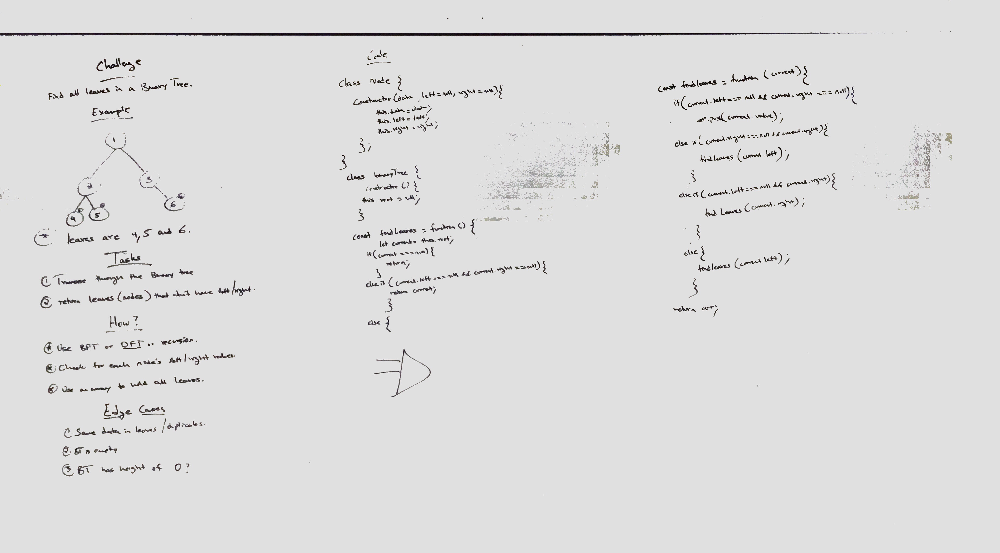

# Code challenge - 17

## Binary trees

## Author: Hanna ALemu

## Intro

# Challenge Summary

Write a function to write all the leaves in a binary tree

## Approach & Efficiency

## Solution

## White board example

