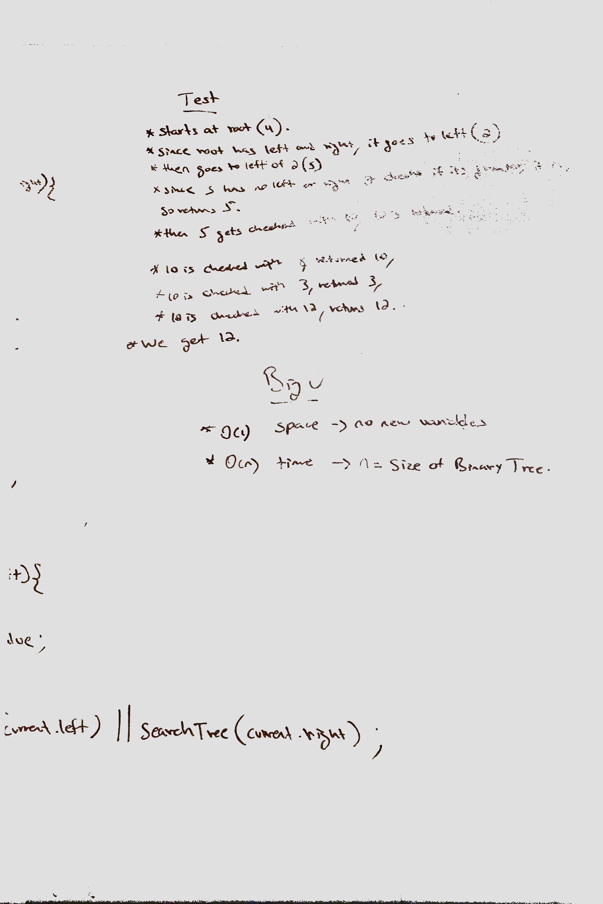

# CODE CHALLENGE 27: Find Maximum value in binary tree

## Author: Hanna Alemu

### Challenge 
Find the maximum value in a binary tree.

### Approach and efficiency

A tree whose elements have at most 2 children is called a binary tree. Since each element in a binary tree can have only 2 children, we typically name them the left and right child.A Binary Tree node contains following parts.

* Data
* Pointer to left child
* Pointer to right child

#### Tests

Install dependencies and run $ npm run test

#### UML

