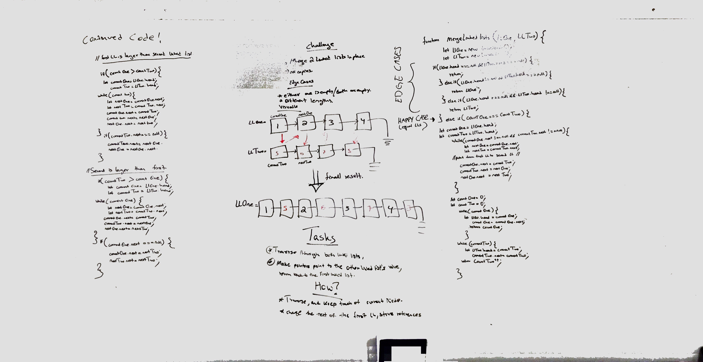
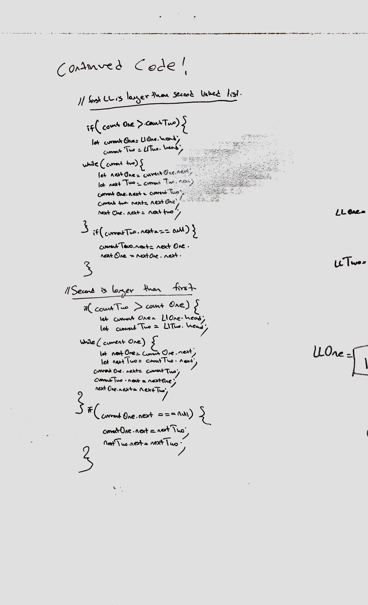
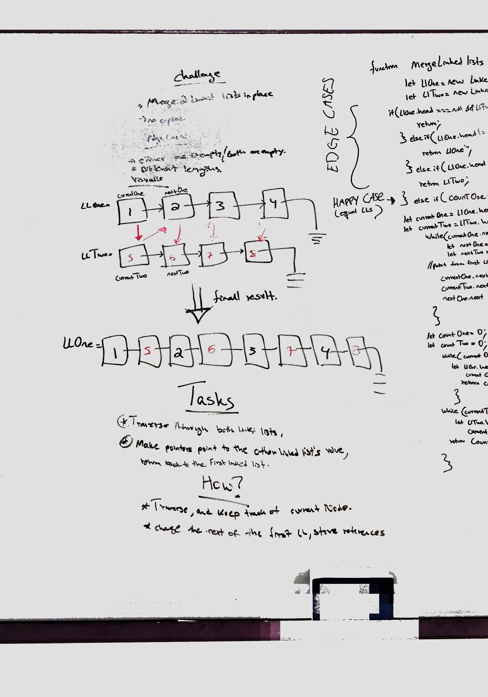
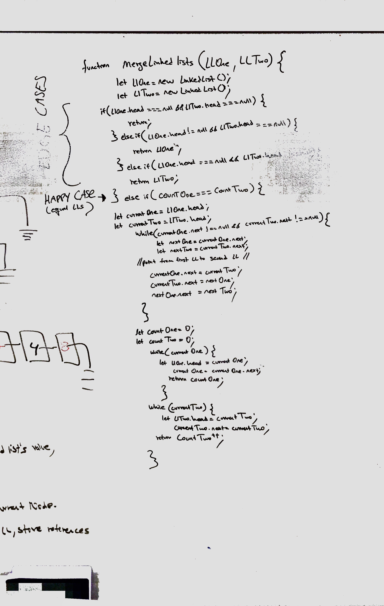

# Code challenge - 07

## Merge Linkedlists

## Author: Hanna ALemu

## Intro

A linked list is an efficient way of storing data in memory. Instead of using arrays which require consecutive space, linked lists store data dynamically. Each data can be stored anywhere, but each data ponts to the next data. Linked lists contain Nodes which can be described as placeholders or boxes that contain the data, also known as values. The linked list has a head, which is the first node and the most important part of the linked list. It also has a tail, which is the last node of the linked list.

# Challenge Summary
Write a function called mergeLists which takes two linked lists as arguments. Zip the two linked lists together into one so that the nodes alternate between the two lists and return a reference to the head of the zipped list. Try and keep additional space down to O(1). You have access to the Node class and all the properties on the Linked List class as well as the methods created in previous challenges.

## Approach & Efficiency
I approached this challenge by manipulating the arrows in the linked lists and keeping track of another variable, 'tracker' that helps us not loose reference to nodes.

## Solution

## White board example

