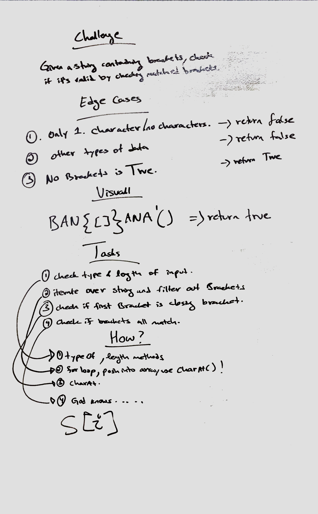
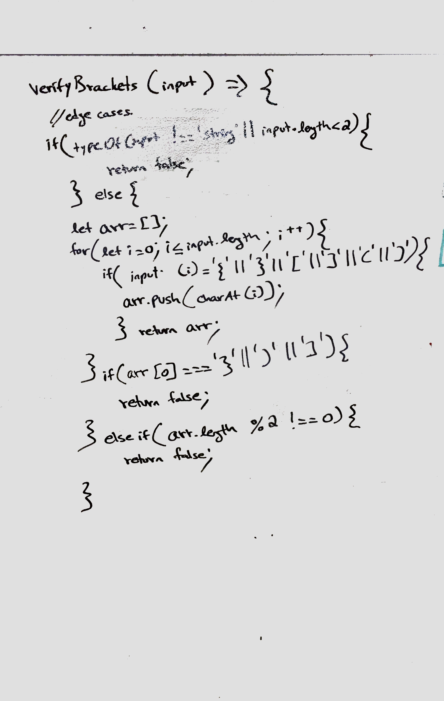

 # MultiBracketValidation(String input)

## Stack
 A stack is a linear data structure in which elements can be inserted and deleted only from one side of the list, called the top. A stack follows the LIFO (Last In First Out) principle, i.e., the element inserted at the last is the first element to come out. The insertion of an element into stack is called push operation, and deletion of an element from the stack is called pop operation. In stack we always keep track of the last element present in the list with a pointer called top.

 ## Challenge
 
Your function should take a string as its only argument, and should return a boolean representing whether or not the brackets in the string are balanced. There are 3 types of brackets:

* Round Brackets : ()
* Square Brackets : []
* Curly Brackets : {}
 

## Approach & Efficiency

## White board

