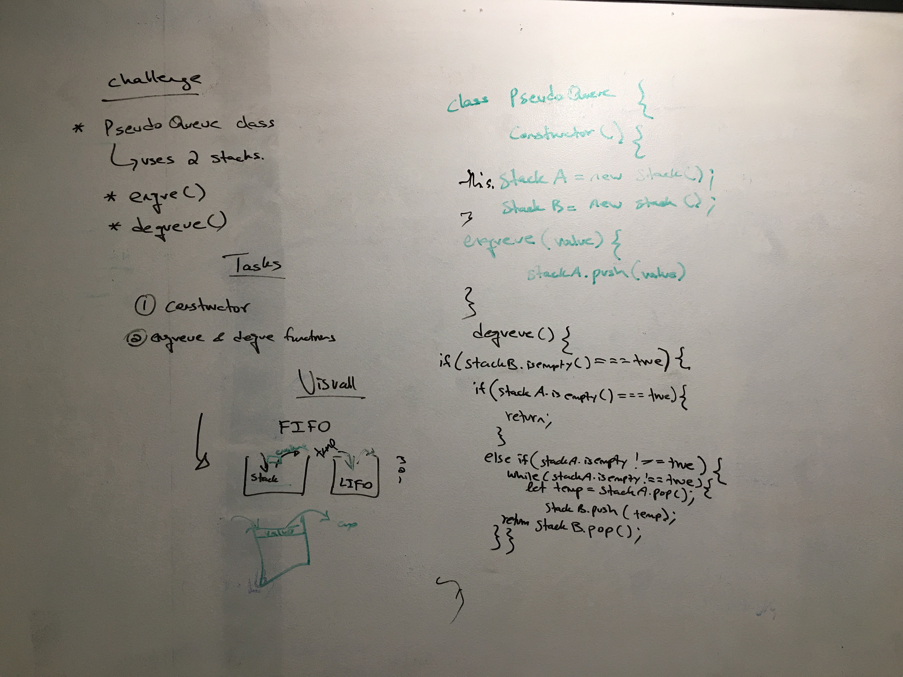

 # Stacks and Queues- PseudoQueue

## Stack
 A stack is a linear data structure in which elements can be inserted and deleted only from one side of the list, called the top. A stack follows the LIFO (Last In First Out) principle, i.e., the element inserted at the last is the first element to come out. The insertion of an element into stack is called push operation, and deletion of an element from the stack is called pop operation. In stack we always keep track of the last element present in the list with a pointer called top.

## Queue: 
A queue is a linear data structure in which elements can be inserted only from one side of the list called rear, and the elements can be deleted only from the other side called the front. The queue data structure follows the FIFO (First In First Out) principle, i.e. the element inserted at first in the list, is the first element to be removed from the list. The insertion of an element in a queue is called an enqueue operation and the deletion of an element is called a dequeue operation. In queue we always maintain two pointers, one pointing to the element which was inserted at the first and still present in the list with the front pointer and the second pointer pointing to the element inserted at the last with the rear pointer.

## Challenge
Create a brand new PseudoQueue class. Do not use an existing Queue. Instead, this PseudoQueue class will implement our standard queue interface (the two methods listed below), but will internally only utilize 2 Stack objects. Ensure that you create your class with the following methods:

enqueue(value) which inserts value into the PseudoQueue, using a first-in, first-out approach.
dequeue() which extracts a value from the PseudoQueue, using a first-in, first-out approach.
The Stack instances have only push, pop, and peek methods. You should use your own Stack implementation. Instantiate these Stack objects in your PseudoQueue constructor.

## Approach & Efficiency

I approached this challenge by using the two stacks and manipulating the way stacks work, using the LIFO methid twice results in the FIFO method of a Queue.

## Whiteboard challenge

