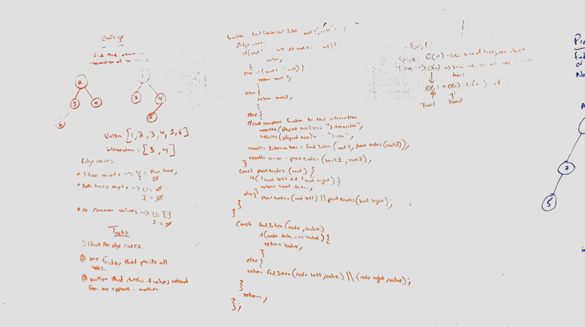
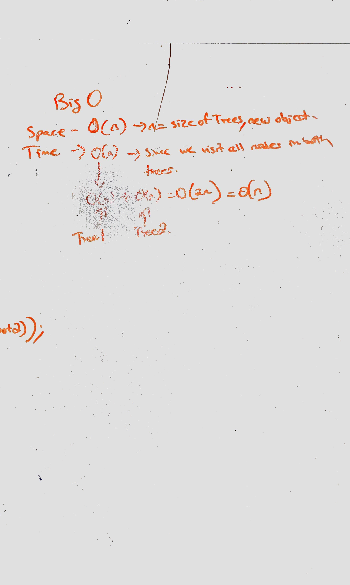

# Code challenge - 31

## Binary trees- find the intersection and union of two binary trees

## Author: Hanna ALemu

## Intro
A tree whose elements have at most 2 children is called a binary tree. Since each element in a binary tree can have only 2 children, we typically name them the left and right child.A Binary Tree node contains following parts.

* Data
* Pointer to left child
* Pointer to right child

A leaf is a node in a tree that doesn't have a left or right node.
# Challenge Summary

Write a function that returns the union and intersection of two trees

## Approach & Efficiency

Initially during whiteboarding, I had a different approach but it was not working because I didn't define a hashmap. I approached this method by using a hash map to keep track of the first tree, then I checked the values of the second tree with the hash map. If they exist, I pushed them into an intersection array, if not into the hash map.At the end, the hashmap is the union of the two. Big O(n) time because we are going through all nodes and O(n) space because the map can get as big as the trees.

## Solution

## White board example

